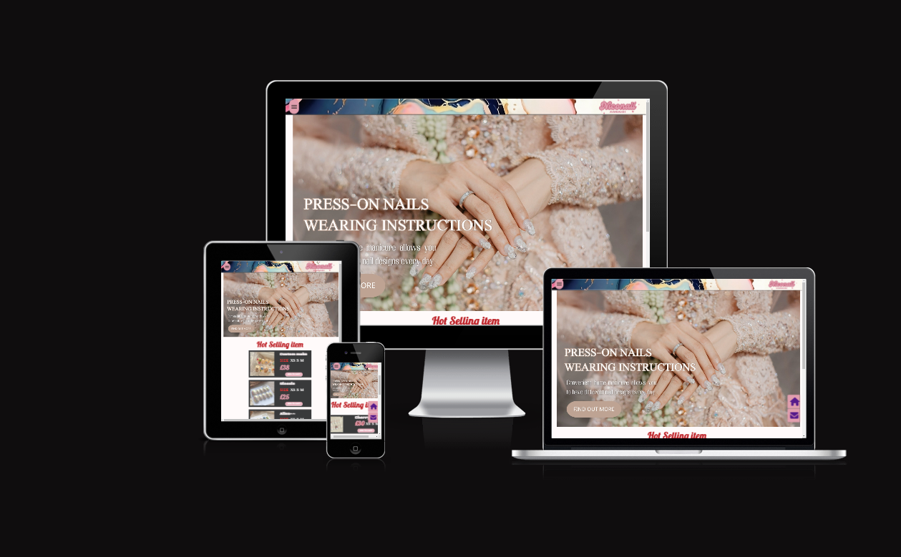
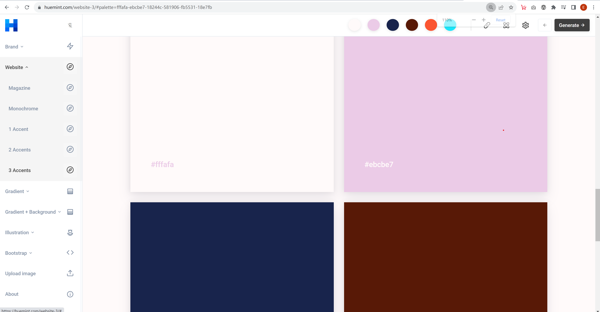
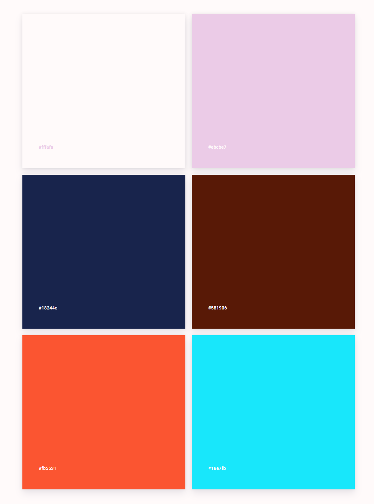

# Niconail
## Welcome to NicoNail
NicoNail is not just an online shop; it's a dynamic community committed to empowering individuals on their expressive journey through captivating nail art. Our platform strives to be the go-to haven for nail enthusiasts, providing a diverse selection of press-on nails that not only enhance your style but also mirror your distinctive personality.

Live link can be found here - [Niconail](https://edisonkwan18.github.io/Project1/)

### Am I Responsive ?
[Image Source - Am I Responsive](https://ui.dev/amiresponsive?url=https://edisonkwan18.github.io/Project1)

## Site Owner Goals
### Our Unique Offerings:

- Personalized Style Choices: Tailor your press-on nail selections daily, effortlessly complementing your outfits for a truly personalized touch.
- Safe for All Ages: NicoNail's press-on nails are gentle, safe, and suitable for all, including pregnant women and children, ensuring a worry-free nail enhancement solution.
- Cost-Effective Versatility: NicoNail offers a budget-friendly alternative with versatile uses, encouraging financial savings without compromising on style.
- Seamless Experience: Bid farewell to the awkward waiting period for natural nails to grow. NicoNail ensures a seamless experience with easy-to-apply press-on nails.
Embrace individuality, celebrate creativity, and redefine your nail art journey with NicoNail, where your nails tell your one-of-a-kind story.

## User Stories/Goals
### Target Audience 
My target customer base is diverse, encompassing individuals of all ages and genders. We offer customized styles to meet specific preferences, tailoring unique nail designs for you. With the non-toxic and safe nature of press-on nails, they can be easily removed at any time, even making them suitable for use by pregnant women and children.

## Design

For the use of color, I utilized Huemint.com to design a series of color codes using the color pink (#ebcbe7) for a color frame. However, later on, the client made adjustments to incorporate her preferred color scheme.

**Credit:Huemint.com** [Huemint](https://huemint.com/)

